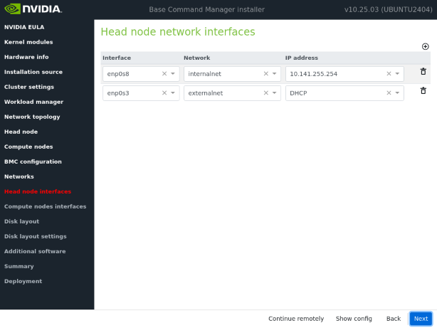
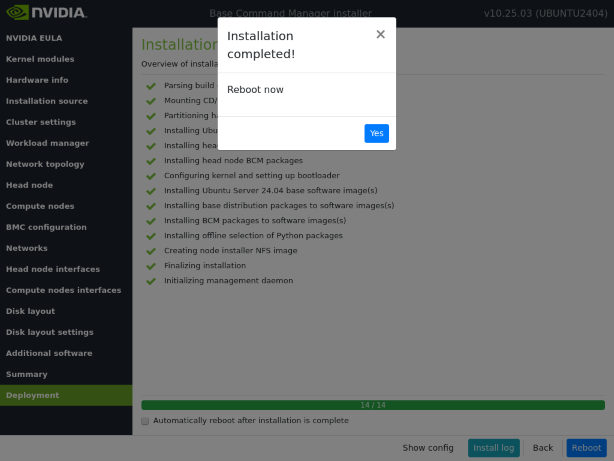

1) Download the targeted Base Command Manager (BCM) ISO image from Nvidia:  
   https://customer.brightcomputing.com/download-iso

2) You will need to enter a valid product key to proceed with the download. To request for a free license to obtain the key:  
   https://www.nvidia.com/en-us/data-center/base-command/manager/

   Log a support case with Nvidi if having issue with the product key provided:  
   https://enterprise-support.nvidia.com/s/create-case  

3) Screenshot on the download page with the product key provided to me. Do ensure to include MOFED Packages which will be required for lustre client installation:  
   

4) Setup a VM with following sample configuration:  
   Processor: 8 x vCPUs  
   Memory: 4GB  
   Single Root VD: 100GB  
   Network: 1 x vNIC (NAT or Brigded, DHCP enabled with internet access; For BCM externalnet)  
            1 x vNIC (Internal Network; For GCM internalnet)    

5) Kick start BCM image installation by selecting "Start Base Command Manager Graphical Installer" from the GRUB boot menu:  
   

6) Follow through the installer wizard, selecting all defaults and entering whatever necessary information as prompted:  
   
   :  
   :  
   
   :  
   :  
   

7) Post installation, login as root with the password entered as prompted earlier from the Installer. Mount the ISO image from the BCM OS:
   ```
   root@bcm10-headnode:~# mount /dev/sr0 /mnt
   mount: /mnt: WARNING: source write-protected, mounted read-only.

   # ls /mnt
   3rd-party-licenses.pdf  BRIGHTDATA.md5  EFI      grub      OSS-Written-Offer.pdf  README.ADDON      README.MODIFY.BRIGHTISO.md
   boot                    data            efi.img  isolinux  python                 README.BRIGHTUSB
   ```
 
8) Proceed to install MOFED from the mounted ISO image by first installing the MOFED deb package:
   ```
   # cd /mnt/data/packages/packagegroups/ofedstacks/amd64
   # ls
   index.xml  mlnx-ofed24.10_24.10.2.1.8.0-100005-cm10.0-574d108822_amd64.deb

   # apt-get install ./mlnx-ofed24.10_24.10.2.1.8.0-100005-cm10.0-574d108822_amd64.deb
   Reading package lists... Done
   Building dependency tree... Done
   Reading state information... Done
   Note, selecting 'mlnx-ofed24.10' instead of './mlnx-ofed24.10_24.10.2.1.8.0-100005-cm10.0-574d108822_amd64.deb'
   The following NEW packages will be installed:
     mlnx-ofed24.10
   0 upgraded, 1 newly installed, 0 to remove and 0 not upgraded.
   Need to get 0 B/511 MB of archives.
   After this operation, 511 MB of additional disk space will be used.
   Get:1 /mnt/data/packages/packagegroups/ofedstacks/amd64/mlnx-ofed24.10_24.10.2.1.8.0-100005-cm10.0-574d108822_amd64.deb mlnx-ofed24.10 amd64 24.10.2.1.8.0-100005-cm10.0-574d108822 [511 MB]
   Selecting previously unselected package mlnx-ofed24.10.
   (Reading database ... 246366 files and directories currently installed.)
   Preparing to unpack .../mlnx-ofed24.10_24.10.2.1.8.0-100005-cm10.0-574d108822_amd64.deb ...
   Unpacking mlnx-ofed24.10 (24.10.2.1.8.0-100005-cm10.0-574d108822) ...
   Setting up mlnx-ofed24.10 (24.10.2.1.8.0-100005-cm10.0-574d108822) ...
   Scanning processes...
   Scanning linux images...

   Running kernel seems to be up-to-date.

   No services need to be restarted.

   No containers need to be restarted.

   No user sessions are running outdated binaries.

   No VM guests are running outdated hypervisor (qemu) binaries on this host.
   ```
   And kick off the installation script with "-h" (head node) option:
   ```
   # cd /cm/local/apps/mlnx-ofed24.10/current/bin
   # ls
   check-dkms-packages.sh  check-prerequisites.sh  install-packages.sh  ipoib-netdevs.sh  linux-dist.sh  mlnx-ofed24.10-install.sh  remove-packages.sh  uname

    # ./mlnx-ofed24.10-install.sh -h
   Mellanox OFED installation, version: 24.10-2.1.8.0 for x86_64.
   On head node, for kernel version: 6.8.0-51-generic.
   Log file: /var/log/cm-ofed.log

   Package directory: /cm/local/apps/mlnx-ofed24.10/24.10-2.1.8.0-ubuntu24.04/DEBS/x86_64

   removing: dapl2-utils ibacm ibsim-utils ibutils ibverbs-providers ibverbs-utils infiniband-diags libdapl2 libibdm1 libibmad5 libibmad5:amd64 libibnetdisc5 libibnetdisc5t64 libibnetdisc5t64:amd64 libibumad3 libipathverbs1 libmlx4-1 libmlx5-1 libmthca1 libopensm2 libopensm9 libosmcomp5 libosmvendor5 librdmacm1 librdmacm1t64 libumad2sim0 mstflint opensm openvswitch-switch perftest rdmacm-utils rdma-core srptools
   purging:  opensm infiniband-diags infiniband-diags srptools libosmvendor5 infiniband-diags ibacm opensm libosmvendor5 opensm libosmvendor5 libopensm9 opensm libdapl2 srptools ibacm
   purging: rdma-core

   Package directory: /cm/local/apps/mlnx-ofed24.10/24.10-2.1.8.0-ubuntu24.04/DEBS/x86_64
   installing: /cm/local/apps/mlnx-ofed24.10/24.10-2.1.8.0-ubuntu24.04/DEBS/x86_64/ofed-scripts_24.10.OFED.24.10.2.1.8-1_amd64.deb
   installing: /cm/local/apps/mlnx-ofed24.10/24.10-2.1.8.0-ubuntu24.04/DEBS/x86_64/mlnx-tools_24.10-0.2410068_amd64.deb
   installing: /cm/local/apps/mlnx-ofed24.10/24.10-2.1.8.0-ubuntu24.04/DEBS/x86_64/mlnx-ofed-kernel-utils_24.10.OFED.24.10.2.1.8.1-1_amd64.deb
   installing: /cm/local/apps/mlnx-ofed24.10/24.10-2.1.8.0-ubuntu24.04/DEBS/x86_64/mlnx-ofed-kernel-dkms_24.10.OFED.24.10.2.1.8.1-1_all.deb
   installing: /cm/local/apps/mlnx-ofed24.10/24.10-2.1.8.0-ubuntu24.04/DEBS/x86_64/iser-dkms_24.10.OFED.24.10.2.1.8.1-1_all.deb
   installing: /cm/local/apps/mlnx-ofed24.10/24.10-2.1.8.0-ubuntu24.04/DEBS/x86_64/isert-dkms_24.10.OFED.24.10.2.1.8.1-1_all.deb
   installing: /cm/local/apps/mlnx-ofed24.10/24.10-2.1.8.0-ubuntu24.04/DEBS/x86_64/srp-dkms_24.10.OFED.24.10.2.1.8.1-1_all.deb
   installing: /cm/local/apps/mlnx-ofed24.10/24.10-2.1.8.0-ubuntu24.04/DEBS/x86_64/mlnx-nfsrdma-dkms_24.10.OFED.24.10.2.1.8.1-1_all.deb
   installing: /cm/local/apps/mlnx-ofed24.10/24.10-2.1.8.0-ubuntu24.04/DEBS/x86_64/mlnx-nvme-dkms_24.10.OFED.24.10.2.1.8.1-1_all.deb
   installing: /cm/local/apps/mlnx-ofed24.10/24.10-2.1.8.0-ubuntu24.04/DEBS/x86_64/kernel-mft-dkms_4.30.1.113-1_all.deb
   installing: /cm/local/apps/mlnx-ofed24.10/24.10-2.1.8.0-ubuntu24.04/DEBS/x86_64/knem-dkms_1.1.4.90mlnx3-OFED.23.10.0.2.1.1_all.deb
   installing: /cm/local/apps/mlnx-ofed24.10/24.10-2.1.8.0-ubuntu24.04/DEBS/x86_64/xpmem-dkms_2.7.4-1.2410068_all.deb
   installing:  rdma-core:amd64 libibverbs1:amd64 ibverbs-utils:amd64 ibverbs-providers:amd64 libibverbs-dev:amd64 libibverbs1-dbg:amd64 libibumad3:amd64 libibumad-dev:amd64 ibacm:amd64 librdmacm1:amd64 rdmacm-utils:amd64 librdmacm-dev:amd64 ibdump:amd64 libibmad5:amd64 libibmad-dev:amd64 libopensm:amd64 opensm:amd64 opensm-doc:amd64 libopensm-devel:amd64 libibnetdisc5:amd64 infiniband-diags:amd64 mft:amd64 perftest:amd64 ibutils2:amd64 ibsim:amd64 ibsim-doc:all ucx:amd64 sharp:amd64 hcoll:amd64 knem:amd64 openmpi:all mpitests:amd64 xpmem:all libxpmem0:amd64 libxpmem-dev:amd64 srptools:amd64 mlnx-ethtool:amd64 mlnx-iproute2:amd64 rshim:amd64 ibarr:amd64
   installing: /cm/local/apps/mlnx-ofed24.10/24.10-2.1.8.0-ubuntu24.04/DEBS/x86_64/mlnx-fw-updater_24.10-2.1.8.0_amd64.deb
   installing: /cm/local/apps/mlnx-ofed24.10/24.10-2.1.8.0-ubuntu24.04/DEBS/x86_64/mlnx-ofed24.10-modules_24.10.2.1.8.0-100005-cm10.0-574d108822_all.deb
   Update kernel module dependencies.
   Enable openibd service.
   marking package "linux-generic" as held back
   marking package "linux-headers-generic" as held back
   marking package "linux-image-generic" as held back

   Installed Mellanox OFED stack DEB packages on head node.

   Done.

   # ofed_info -s
   MLNX_OFED_LINUX-24.10-2.1.8.0:
   ```

9) Upload the latest EXA client software package to DGX OS image:  
   ```
   # scp exa-client-6.3.4.tar.gz root@192.168.1.13:/root
   ```

10) Objective here is to download the list of software packages dependency for offline EXA client installation. Extract and run exa_client_deploy.py without internet connection, disabling all respositories by simply renaming the /etc/apt/sources.list.d directory:  
    ```
    # mv /etc/apt/sources.list.d /etc/apt/sources.list.d.bak
    # route del default gw 192.168.1.1
    # ping www.google.com
    ping: connect: Network is unreachable
    # cd /root
    # tar xf exa-client-6.3.4.tar.gz
    # cd exa-client/
    # ./exa_client_deploy.py

    DDN EXAScaler client software installation tool: Version 6.3.3
    Select an option:

    1) Check if DDN EXAScaler client software is installed
    2) Install DDN EXAScaler client software
    3) Configure DDN EXAScaler client software
    4) Remove DDN EXAScaler client software
    5) List DDN EXAScaler mount commands
    6) Exit
    2

    Selected /root/exa-client/lustre-source.tar.gz for installation

    Preparing build environment...
    Unable to prepare build environment. Failed command: DEBIAN_FRONTEND=noninteractive apt-get -y install attr autoconf automake bc bison build-essential bzip2 cpio debhelper devscripts ed fakeroot fio flex gcc gettext git golang kernel-wedge keyutils kmod krb5-multidev libaio-dev libattr1-dev libaudit-dev libbison-dev libblkid-dev libc6-dev libelf-dev libgssapi-krb5-2 libjson-c-dev libkeyutils-dev libkeyutils1 libkrb5-3 libkrb5-dev liblzma-dev libmount-dev libnl-3-dev libnl-genl-3-dev libpam0g-dev libpython3-dev libreadline-dev libselinux-dev libsnmp-dev libssl-dev libtool libtool-bin libudev-dev libyaml-dev lsof m4 make module-assistant pkg-config python3 python3-dev python3-netaddr python3-netifaces python3-setuptools quilt rsync sg3-utils swig systemd wget zlib1g-dev
    ```

11) Based on the listed required packages, reinstate back all repositories and perform a "download-only" install to a holding directory ``/tmp/ddn-extra-debs-bcm10.25.03-EXA634`` after establishing back internet connectivity:  
    ```
    # route add default gw 192.168.1.1
    # mv /etc/apt/sources.list.d.bak /etc/apt/sources.list.d
    # mkdir /tmp/ddn-extra-debs-bcm10.25.03-EXA634
    # apt-get update
    # export DEBIAN_FRONTEND=noninteractive
    # apt-get -y install --download-only -o Dir::Cache::archives=/tmp/ddn-extra-debs-bcm10.25.03-EXA634 attr autoconf automake bc bison build-essential bzip2 cpio debhelper devscripts ed fakeroot fio flex gcc gettext git golang kernel-wedge keyutils kmod krb5-multidev libaio-dev libattr1-dev libaudit-dev libbison-dev libblkid-dev libc6-dev libelf-dev libgssapi-krb5-2 libjson-c-dev libkeyutils-dev libkeyutils1 libkrb5-3 libkrb5-dev liblzma-dev libmount-dev libnl-3-dev libnl-genl-3-dev libpam0g-dev libpython3-dev libreadline-dev libselinux-dev libsnmp-dev libssl-dev libtool libtool-bin libudev-dev libyaml-dev lsof m4 make module-assistant pkg-config python3 python3-dev python3-netaddr python3-netifaces python3-setuptools quilt rsync sg3-utils swig systemd wget zlib1g-dev
    ```

12) Above downloaded packages might not be the complete list as there might be different hierarchical level of dependencies. Disable internet connectivity and perform an offline install for those downloaded packages:  
    ```
    # route del default gw 192.168.1.1
    # export DEBIAN_FRONTEND=noninteractive
    # apt-get -y install /tmp/ddn-extra-debs-bcm10.25.03-EXA634/*.deb
    ```

13) Re-run exa_client_deploy.py with no internet access:
    ```
    # /root/exa-client/exa_client_deploy.py

    DDN EXAScaler client software installation tool: Version 6.3.3
    Select an option:

    1) Check if DDN EXAScaler client software is installed
    2) Install DDN EXAScaler client software
    3) Configure DDN EXAScaler client software
    4) Remove DDN EXAScaler client software
    5) List DDN EXAScaler mount commands
    6) Exit
    2

    Selected /root/exa-client/lustre-source.tar.gz for installation

    Preparing build environment...
    Preparing build environment... Done

    Building EXAScaler client software. This may take a while...
    EXAScaler client software packages are installed and placed in /opt/ddn/exascaler/debs folder
    Use option 3 to configure EXAScaler client software before loading lustre module

    DDN EXAScaler client software installation tool: Version 6.3.3
    Select an option:

    1) Check if DDN EXAScaler client software is installed
    2) Install DDN EXAScaler client software
    3) Configure DDN EXAScaler client software
    4) Remove DDN EXAScaler client software
    5) List DDN EXAScaler mount commands
    6) Exit
    1
    Found installed EXAScaler client software packages version 2.14.0-ddn212-1:

    lustre-client-modules-6.8.0-51-generic
    lustre-client-utils
    lustre-dev
    lipe-lpcc

    DDN EXAScaler client software installation tool: Version 6.3.3
    Select an option:

    1) Check if DDN EXAScaler client software is installed
    2) Install DDN EXAScaler client software
    3) Configure DDN EXAScaler client software
    4) Remove DDN EXAScaler client software
    5) List DDN EXAScaler mount commands
    6) Exit
    6
    ```

14) Fortunately there are no other packages dependency being flagged out and EXA client software installation completed successfully. If there are further packages being flagged out, loop back step (10) to (13) repeatedly until installation can go through completely.  

15) Now we have ``/tmp/ddn-extra-debs-bcm10.25.03-EXA634`` containing all the additional deb packages required for EXA client offline install specifically to the version of BCM image to be deployed with.  
