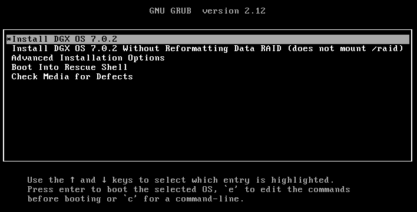

- Download the targeted DGX OS ISO image from Nvidia:  
  https://enterprise-support.nvidia.com/s/downloads
- Setup a simple VM with following sample configuration:  
  Processor: 2 x vCPUs  
  Memory: 2GB  
  Single Root VD: 50GB  
  Networt: 1 x vNIC (NAT or Brigded, DHCP enabled with internet access)
  EFI Boot: Enabled (Important. DGX OS is configured for booting with EFI)  
- Kick start DGX OS image installation by selecting "Install DGX OS 7.0.2" from the GRUB boot menu:
  
- Post installation, permit direct ssh as root for ease of operation instead of having to sudo everytime a elevated privilegde is required.
  ```
  login as: uadmin
  uadmin@192.168.1.6's password:
  Welcome to NVIDIA DGX on VirtualBox Version 7.0.2 (GNU/Linux 6.8.0-55-generic x86_64)

   System information as of Fri Jun 27 16:11:17 +08 2025

    System load:  0.0                Processes:               118
    Usage of /:   10.1% of 48.42GB   Users logged in:         1
    Memory usage: 12%                IPv4 address for enp0s3: 192.168.1.6
    Swap usage:   0%
  Last login: Fri Jun 27 16:09:17 2025 from 192.168.1.33
  To run a command as administrator (user "root"), use "sudo <command>".
  See "man sudo_root" for details.
  
  uadmin@dgx01:~$ sudo su -
  root@dgx01:~# echo "PermitRootLogin yes" >> /etc/ssh/sshd_config
  root@dgx01:~# passwd
  New password:
  Retype new password:
  passwd: password updated successfully
  root@dgx01:~# systemctl restart ssh
  ```
- bb
- bbb
- bbb
- bbb
