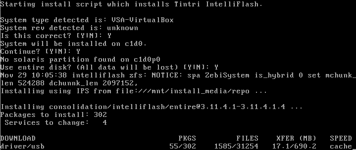

1. Download iso image from http://s1.tegile.com/ps/fw
   - Example: http://s1.tegile.com/ps/fw/Aachen/Release-SW/Intelliflash-3_11_4_1.4.iso

2. Configure two VM for HA pair setup. Sample VM configuration:
   - OS Type: OpenSolaris (64-bit)
   - vCPUs: 4
   - Memory: 12GB (Tested with 8GB and below -> VM will hang during cluster startup)
   - ISO Image: Intelliflash-3_11_4_1.4.iso
   - Root Disk: 20GB
   - HBA for Data Disks: AHCI (SATA) (Tried SAS controller type but assigned vdisks will not be recognised by ZebiOS)
   - Data Disk: Starts with one VDH, any size and must be configured as shareable. To be assigned as quorum disk during cluster configuration.
   - NIC: Assign two network adapter. One for mgmt while the other for cluster interconnect.
     

3. Proceed to boot from the IntelliFlash ISO image:  
   

4. After booting, follow onscreen instructions to install IntelliFlash base OS (ZebiOS) and software:
   
   
   

5. Reboot for the freshly installed system to take effect:
   

6. 
7. 
8. 
9. 
10. 
11. 
12. 
13. 
14. 
15. 
16. 
17. 
18. 
19. 
20. 
   
