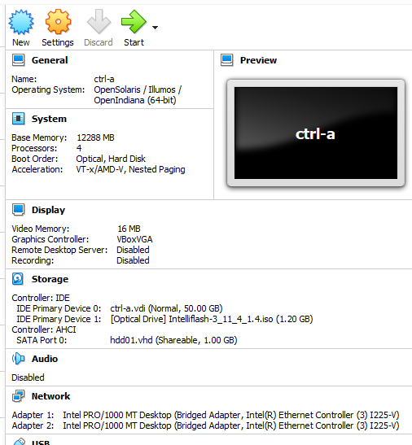

### 1. Download iso image from http://s1.tegile.com/ps/fw
  - Example: http://s1.tegile.com/ps/fw/Aachen/Release-SW/Intelliflash-3_11_4_1.4.iso
---
### 2. Configure two VM for HA pair setup. Sample VM configuration:
  - OS Type: OpenSolaris (64-bit)
  - vCPUs: 4
  - Memory: 12GB (Tested with 8GB and below -> VM will hang during cluster startup)
  - ISO Image: Intelliflash-3_11_4_1.4.iso
  - Root Disk: 50GB
  - HBA for Data Disks: AHCI (SATA) (Tried SAS controller type but assigned vdisks will not be recognised by ZebiOS)
  - Data Disk: Starts with one vdisk, any size and must be configured as shareable. To be assigned as quorum disk during cluster configuration.
  - NIC: Assign two network adapter. One for mgmt while the other for cluster interconnect.
    
---
### 3. Proceed to boot from the IntelliFlash ISO image:  
   
---
### 4. After booting, follow onscreen instructions to install IntelliFlash base OS (ZebiOS) and software:
   
   
   
---
### 5. Reboot for the freshly installed system to take effect:
   
---
### 6. Once system rebooted, login as root / root123:
   
---
### 7. Before proceeding with the "zebiconfig.sh" configuration script to perform initial setup, verify the device name to be assigned for quorum, mgmt and cluster interconnect interfaces.
 - To check on the quorum disk to assign:
   ```
   [root@intelliflash:~]# echo | format
   Searching for disks...done

   AVAILABLE DISK SELECTIONS:
          0. c1d0 <Unknown-Unknown-0001 cyl 6523 alt 2 hd 255 sec 63>
             /pci@0,0/pci-ide@1,1/ide@0/cmdk@0,0
          1. c2t0d0 <VBOX-HARDDISK-1.0-1.00GB>
             /pci@0,0/pci8086,2829@d/disk@0,0
   Specify disk (enter its number): Specify disk (enter its number):
   ```
   From above ouput, "c2t0d0" shall be the disk to be assigned as the quorum disk.
 - To check on the network interfaces to assign:
   ```
   [root@intelliflash:~]# dladm show-link
   LINK        CLASS     MTU    STATE    BRIDGE     OVER
   e1000g0     phys      1500   unknown       --         --
   e1000g1     phys      1500   unknown  --         --
   ```
   e1000g0 -> Will be assigned for mgmt interface.  
   e1000g1 -> Will be assigned for cluster interconnect.  
---
### 8. Kick start the initial configuration script "zebiconfig.sh".
 - Initial screen:  
     
 - Enter hostname and domainname for controller:  
   
 - 'Y' to configure as HA pair and enter the quorum and interconnect device name as capture in step (7):  
    
   
 - Time zone configuration:  
   
   
   
   
 - Setup the password for 'zebiadmin', 'root' & 'admin':  
   
 - Answer 'N' for NDMP, IntelliCare & KVM settings.  
 - And complete the rest of configuration settings as prompted:  
   
 - Reboot the system when prompted.  
---
### 9. Upon system rebooted, web console will be available to manage the system.  
- Web console login:  
    
- To view the allocated disk(s), from top menu navigate to Settings -> Hardware:  
  
- To "trick" system to recognize the data disk as SSD instead (since this is just a simulator setup), we can edit the disks' model configuration file ```/opt/tomcat/webapps/zebi/model/ssdmodel.xml```. Steps:  
  - Establish ssh session to the VM as "zebiadmin" and "su -" for root access:
    ```
    -bash-4.4$ ssh zebiadmin@ctrl-a
    (zebiadmin@ctrl-a) Password:

    Welcome to Tintri IntelliFlash.
    Access to the system console is restricted. If you are not authorized
    to access the system console, please logout and leave immediately.

    -bash-4.4$ su -
    Password:

    Welcome to Tintri IntelliFlash.
    Access to the system console is restricted. If you are not authorized
    to access the system console, please logout and leave immediately.

    [root@ctrl-a:~]#
    ```
  - Check assigned virtual disk's vendor and product type:
    ```
    [root@ctrl-a:~]# echo | format
    Searching for disks...done

    AVAILABLE DISK SELECTIONS:
           0. c1d0 <Unknown-Unknown-0001 cyl 6523 alt 2 hd 255 sec 63>
              /pci@0,0/pci-ide@1,1/ide@0/cmdk@0,0
           1. c2t0d0 <VBOX-HARDDISK-1.0-1.00GB>
              /pci@0,0/pci8086,2829@d/disk@0,0
    Specify disk (enter its number): Specify disk (enter its number):
       
    [root@ctrl-a:~]# sg_inq /dev/rdsk/c2t0d0s2 | grep Product
     Product identification: VBOX HARDDISK
     Product revision level: 1.0
    [root@ctrl-a:~]#
    ```
  - Add an entry in ```/opt/tomcat/webapps/zebi/model/ssdmodel.xml``` (contents within the xml file are self explanatory) to recognize "VBOX" "HARDDISK" as flash disk. Sample "VBOX" entry added:
    ```
    [root@ctrl-a:/]# egrep "flash|VBOX" /opt/tomcat/webapps/zebi/model/ssdmodel.xml
            <!-- empty bias means it's for general data (all-flash) purpose -->
            <model name="HARDDISK" vendor="VBOX" bias="" />
    ```
  - Restart the web console service (tomcat) to take effect.
    ```
    [root@ctrl-a:/]# svcadm restart tomcat
    [root@ctrl-a:/]# svcs tomcat
    STATE          STIME    FMRI
    online*        16:48:48 svc:/network/tomcat:default
    ```
  - From web console, navigate back to Settings -> Hardware section and you will find the data disk has been recognized as SSD:  
      
---
### 10. Repeat above steps (2) to (9) to setup VM for "ctrl-b". Things to take note:
 - Assign the same quorum disk (c2t0d0 as shown above) to this VM as the name's function imply.
 - IMPORTANT - At step (8), before executing "zebiconfig.sh" script please do edit below indicated environment profile scripts first.
   Before changes:
   ```
   # grep CONTROLLER_NO /etc/zebi/env.bash
   export CONTROLLER_NO="0"
   # grep CONTROLLER_NO /etc/zebi/env.sh
   CONTROLLER_NO="0"
   ```  
   After changes:
   ```
   # grep CONTROLLER_NO /etc/zebi/env.bash
   export CONTROLLER_NO="1"
   # grep CONTROLLER_NO /etc/zebi/env.sh
   CONTROLLER_NO="1"
   ```  
   Above changes will indicate this VM as the second controller else there will be issues when setting up the HA pair as both will think they are the first controller 0.
---
### 11. Verifying correct VM's node assignment.
 - Establish ssh session to each VM:
   - From VM designated as Controller A:
     ```
     [root@ctrl-a:~]# cat /etc/hanodename
     ha-controller-a
     ```
   - From VM designated as Controller B:
     ```
     [root@ctrl-b:~]# cat /etc/hanodename
     ha-controller-b
     ```
---
### 12. Establish HA Pair. 
 - Login to ctrl-b web console. From top menu, Settings -> High Availability
  
 - Click "Configure HA" and you will be prompted to enter peer node (ctrl-a) login credential. 
   
 - Configuration of peer node (ctrl-a) will start and reboot. ctrl-b will follow next automatically after ctrl-a has rebooted into cluster mode.  
   
 - It will take a while for both nodes to be configured into HA pair. When HA has been established, login to the web console of either ctrl-a or ctrl-b. After login in as admin, you will be presented with the Initial Configuration Wizard (ICW) page:
   
 - For unknown reason, you will not be able to proceed any further with the ICW as whatever settings entered, can't be saved (click "save" but nothing will happen). That should not be a concern as we can always configure the rest of settings manually. To disable ICW, establish a ssh session with either ctrl-a or ctrl-b:
   - Execute "zebiconfig.sh" script -> Enter choice [2]:
     ```
                       Tintri IntelliFlash Configuration

      1) Setup Mgmt and KVM IP
      2) Show complete menu
      3) Exit
      Enter choice [3]: 2
     ```
   - Enter choice [16]:
     ```
                       Tintri IntelliFlash Configuration

      1) Support logs generation
      2) Customer details
      3) Hostname/Domain
      4) DNS
      5) Networking
      6) Date/Time
      7) IntelliFlash user passwords
      8) Web-Interface SSL certificate
      9) SMF services debugging
     10) Dtrace script debugging
     11) JPDA and Tomcat debugging
     12) Analytics Mode
     13) Configure IntelliCare
     14) Configure KVM Networking
     15) Configure all
     16) Configure Initial Configuration Wizard
     17) Configure NDMP
     18) Enable End User License Agreement
     19) Generate NPIV
     97) Reset to Factory Settings
     98) Reset to Install State
     20) Go back to previous menu
      Enter choice [20]: 16
      ```
   - Enter "Y" to disable ICW:
     ```
                       Tintri IntelliFlash Configuration
                       
     Do you wish to enable/disable Initial Configuration Wizard?[Y/N]Y
     Initial Configuration Wizard is currently enabled. Do you want to disable it?[Y/N]Y
        
     Initial Configuration Wizard is disabled now.
     Press 'Enter' to return to main menu
     ```
  - With ICW disabled, the usual web console menu will appear:
    
  - To complete the HA pair setup, from top menu navigate to Settings -> Network and fill up all the required settings especially the array hostname and floating management IP (these are the settings that can't be saved from ICW):
     
  - From now onward, web console should be accessed from the array floating management IP.
  - Checkpoint on HA status from web console (Settings -> High Availability):
    
  - Checkpoint on HA status from web console (Settings -> Network -> Interface):
    
---
### 13. Proceed to add more disks and network ports to both VMs for useful pools, projects, NAS and SAN configuration.
 - Do take note you will require a minmum of 8+1 ssd disks for all flash raidz2 pool or minimum 12+1 hdd disks for raidz2 hdd pool setup. This constraint can be obtained from configuration files residing in ```/opt/tomcat/webapps/zebi/WEB-INF/classes/main-config``` 
 - Example: ```/opt/tomcat/webapps/zebi/WEB-INF/classes/main-config/raidz2-SSD.conf```
   ```
   # head -n 15 raidz2-SSD.conf
   # n=a,b,c
   # n: #disks allocated for data
   # a: #disks to be allocated for vdev1
   # b: #disks to be allocated for vdev2
   # c: #disks to be allocated for vdev3
   # If n > (a + b +c), the remaining disks [n - (a + b + c)] will be left unused
   # If n > MAX_SIZE, the conf file lookup happens after reserving 12x disks beforehand, where x is such that (n - 12x) <= MAX_SIZE
   # Note: No need to restart tomcat when the conf file is updated for any reason
      
   MIN_DATA_SPARE_CREATE=1
   MIN_META_SPARE_CREATE=0
   ADDITIONAL_SPARE_THRESHOLD=-1
      
   8=8
   9=9
   ```
 - Example: ```/opt/tomcat/webapps/zebi/WEB-INF/classes/main-config/raidz2-HDD.conf```
   ```
   # head -n 15 raidz2-HDD.conf
   # n=a,b,c
   # n: #disks allocated for data
   # a: #disks to be allocated for vdev1
   # b: #disks to be allocated for vdev2
   # c: #disks to be allocated for vdev3
   # If n > (a + b +c), the remaining disks [n - (a + b + c)] will be left unused
   # If n > MAX_SIZE, the conf file lookup happens after reserving 12x disks beforehand, where x is such that (n - 12x) <= MAX_SIZE
   # Note: No need to restart tomcat when the conf file is updated for any reason
      
   MIN_DATA_SPARE_CREATE=1
   ADDITIONAL_SPARE_THRESHOLD=-1
      
   12=6,6
   13=7,6
   14=7,7
   ```
---
### 14. Additional notes:
 - Some useful shell session directories, files and commands:
   ```
   /opt/tomcat/webapps/zebi/WEB-INF/classes/main-config
   /usr/cluster/bin
   /etc/cluster/nodeid
   /etc/hanodename
   /usr/sbin/zebiversion.sh
   /etc/release
   /usr/cluster/bin/scinstall -p -v
   ipadm show-addr
   ipadm show-if
   dladm show-vlan
   dladm show-link
   dladm show-aggr
   dladm show-aggr -L
   zpool list
   zpool status
   zfs list
   /usr/bin/diskencrypt get-status -a
   fmadm faulty -s
   fmadm acquit
   /usr/cluster/bin/cluster status
   /usr/cluster/bin/clrg status
   ```
- Command to check BMC IP Addresses:
  ```
  /opt/local/bin/ipmitool lan print 8
  ```
- To list and recover retired devices:
  ```
  strings /etc/devices/retire_store
  mv /etc/devices/retire_store /etc/devices/retire_store.bak
  rm /dev/es/ses*
  rm /dev/smp/expd*
  touch /reconfigure
  reboot
  ```
